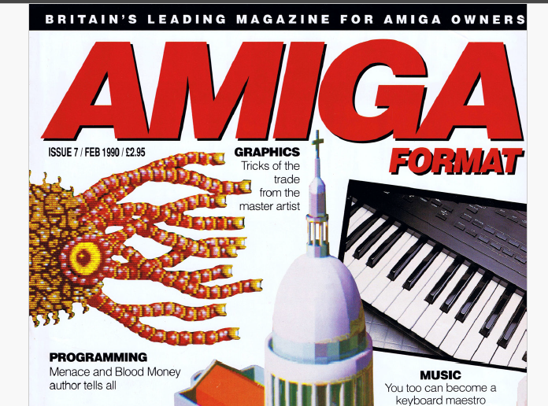
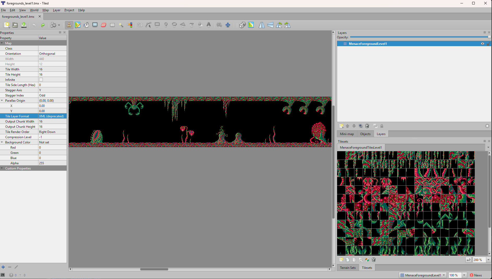
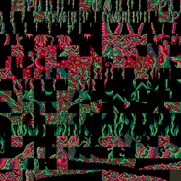

# Menace Amiga Format

The 1988 Amiga game 'Menace' that was published in Amiga Format in 1990, this repo contains source code and changes that were made for the YouTube video series about it on http://www.youtube.com/@DavePoo2
 The plan is to upgrade this source to assemble and work for a more modern Amiga (source was written during the A1000/500 era of the Amiga)

https://www.youtube.com/playlist?list=PLr783JgI3IBd9PZuc9WMmwwxoG2ic-NzB - Video series playlist

The aim of this is...

* Nostalgia - I read and learned from these articles back in the day, and I'd like to re-vist them
* To look at some old Amiga source code, find out how it works and learn from it
* To try to develop (as much as possible) like it was done in the good ol' days to see what we had to put up with (developing on the Amiga for the Amiga)
* To upgrade the source to compile for Workbench 3.2 and work on other Amigas than just the A500. Possibly just upgrade to work on AGA machines (as we alreday have the non-AGA version in the release title)
* To upgrade the source/game to work on the newer Amigas, not downgrade or cripple the Amiga to make the game work (WHDLoad can do that)
* To preserve the source code, articles & coverdisks for the future (should they dissapear from other online sources)

# Amiga Format - Dave Jones / Menace Articles - 'The Whole Truth About Games Programming'

The source was published across the following editons of Amiga Format in 1990. Articles on how the source code worked were written up by Dave Jones to go with the source.

* [Issue 7](AmigaFormat/AmigaFormat007-Feb90_DaveJonesLockerPart1.pdf) - February 1990 - Pages 63 to 68 - 'The Whole Truth About Games Programming'
* [Issue 8](AmigaFormat/AmigaFormat008-Mar90_DaveJonesLockerPart2.pdf) - March 1990 - Pages 63 - 67 - 'The Whole Truth About Games Programming: 2'
* [Issue 9](AmigaFormat/AmigaFormat009-Apr90_DaveJonesLockerPart3.pdf) - April 1990 - Pages 63 - 67 -'The Whole Truth About Games Programming: 3'
* [Issue 10](AmigaFormat/AmigaFormat010-May90_DaveJonesLockerPart4.pdf) - May 1990 - Pages 85 to 89 -'The Whole Truth About Games Programming Part 4 aliens'
* [Issue 11](AmigaFormat/AmigaFormat011-Jun90_DaveJonesLockerPart5.pdf) - June 1990 - Pages 119 to 121 -'The Whole Truth About Games Programming Part 5 aliens 2'
* [Issue 12](AmigaFormat/AmigaFormat012-Jul90_DaveJonesLockerPart6.pdf) - July 1990 - 155 to 158 - 'The Whole Truth About Games Programming Part 5 [sic] Collision Detection'
* [Issue 13](AmigaFormat/AmigaFormat013-Aug90_DaveJonesLockerPart7.pdf) - August 1990 - Pages 127 to - 130 - 'The Whole Truth About Games Programming Part 7 The Guardian'
 
Note that July 1990 edition says "Part 5" but is actually "[Part 6](AmigaFormat/AmigaFormat012-Jul90_DaveJonesLockerPart6.pdf)" but does say "Games Programming 6" in the header of the page.

 [You can find PDF scans of the articles in the AmigaFormat folder](AmigaFormat/), or alternatively use these 'Amiga Magazie Rack' links
* Issue 7 - https://amr.abime.net/issue_163
* Issue 8 - https://amr.abime.net/issue_164
* Issue 9 - https://amr.abime.net/issue_165
* Issue 10 - https://amr.abime.net/issue_166
* Issue 11 - https://amr.abime.net/issue_167
* Issue 12 - https://amr.abime.net/issue_168
* Issue 13 - https://amr.abime.net/issue_169

## Cover Disk Code

Coverdisk ADFs are in this repository under [AmigaFormat/CoverDiskADFs/](AmigaFormat/CoverDiskADFs)

The code was built up each edition via the files on cover disks.
The last coverdisk does contain all the source that was ever published, but a few of the files that were required are only available by pulling them from a previous cover disk.
I have pulled all the files together in one place to create [the newer source code](Source).

# Assembing on the Amiga

The upgraded code is in the [Source/](Source) folder in this repository. Open [MENACE.S](Source/MENACE.S) and assemble the run the created 'Menace' executable file.

The code has been going through changes to upgrade to Workbench 3.2, but I am still assembing in DevPac on an Amiga.
* DevPac 3 (I am using DevPac 3.01 but later versions should probably work ) https://archive.org/download/CommodoreAmigaApplicationsADF
* Workbench NDK 3.2 (I am using NDK3.2 Release 1) https://www.hyperion-entertainment.com/index.php/downloads

## DevPac 3 Settings

These are the settings I am using to assemble correctly in DevPac 3 on the Amiga.

* Assembler Control Include folder is set to the :NDK3.2/Include_I (go to Settings -> Assember -> Control), and the 'Headers' is left blank (DevPac will have some WB 2 includes .gs file in there by default )

* Assembler Options Processor is set to 68020 (go to Settings -> Assember -> Options)

* 'Settings -> Assemble To Disk' is checked to out the file after assembly.

# Other Useful Resources

* https://www.amazon.co.uk/Bare-Metal-Amiga-Programming-OCS-ECS/dp/B09GJQ3SF6 - Edwin Th van den Oosterkamp (Author) - Bare-Metal Amiga Programming: For OCS, ECS and AGA

# Graphics Conversion Tools

Menace in Amiga Format never shipped with any tools required to make the graphics/sound/music, and the graphics that were shipped in the game had already been processed into a format that was only readable by the game. Some are stored in their own file and some are embedded as data that is compiled into the code.
I've been slowly making some effect to reverse those files back out into files that can be edited (on PC). I'm putting them into more PC friendly formats to take advantage of any tools that already exist on the PC for editing, rather than writing a bunch from scratch for the Amiga.

* [MenanceToPNG](Tools/PC/GraphicsConverter/MenaceToPNG/Program.cs) is a PC C# script that is converting much of the data.
* [GraphicsConverter/Data/PNG](Tools/PC/GraphicsConverter/Data/PNG/) contains the data that I have so far converted back out of the game

I've exported the background and foreground image and map data into a format that can be read by [Tiled Map Editor](https://www.mapeditor.org/)

The foreground map data can be exported from "Tiled" using the  export script. This script needs to be added to the "Tiled" extensions folder to be seen as an option on the "Export As" screen. I've called the file extension .vmap, but Menace had no file extensions for any of it's file formats.

# File Formats

These are the orginal file formats for the Menace Source Code as provided by the Amiga Format source:

## Aliens - Source/ALIENS

This file contains all the level 1 aliens and the explosion packed into a single file.

* Each frame of an alien is 32w x 24h x 4 bitplanes.
* There are 3 bit planes + 1 mask bit plane. The mask is stored last
* Each alien can have a different numbers of frames, the number per alien is hard coded into the source code, it is not encoded in the file, so changing the number of frames requires a source code change.
* Note that the large *border* alien is split into 4 parts top-left, bottom-left, top-right, bottom-right
* see *alien.pointers* in MENACE.S for where the number of frames (and byte offsets are encoded)

| Alien         | Num Frames    |
|-----          | ---           | 
| explosion1    | 9             | 
| guardian.eye1 | 4             |
| tadpole       | 4             |
| eye           | 15            |
| bubble        | 4             |
| jellyfish1    | 4             |
| jellyfish2    | 4             |
| bordertl      | 6             |
| borderbl      | 6             |
| bordertr      | 6             |
| borderbr      | 6             |
| mouth         | 8             |
| slime         | 9             |
| snakebody     | 1             |
| snakehead     | 5             |

The colour palette for each alien is stored in 
"alien.colours" in MENACE.S

Each *DC.W* line encodes 8 colours for each alien starting on the 3rd line (e.g. line 3 is the 8 colours for *explosion1* ). see "copy.path" in MENACE.S for where it copies the palettes in for an alien.

The 8 colours are shared with the background tiles, so the first 3 entries in each alien palette are the same 3 colours (for the tiles). The other 5 are used for the alien itself (however each alien defines all 8 colours so if the first 3 were to change then the background would change colour when that alien appeared on screen.)

## Backgrounds (Assembled into MENACE.S)

* *backgrounds* - is the pixel data for the background tileset
* *backgroundtable* - is the tile map

### backgroundtable

This is encoded as 4-bits per tile index, allowing for a maximum possible tileset count of 16 tiles.

The tiles map is 24w x 12h and stored in row order (top row, 2nd row, 3rd row etc...)

### backgrounds

These are 16w x 16h x 2 bit plane tiles with no mask.

There is a max possible count of 16 tiles, but there are only 12 level 1 tiles encoded into the source.

Tiles are stored sequentially, index 0 is stored first.

The palette is encoded into "level.colours" in MENACE.S but each alien also overwrites that palette.

## Foregrounds ( Source/map & Source/foregrounds )

* *foregrounds* - This is the pixel data for the foreground tileset
* *map* - This is the tile map

### foregrounds

These are 16w x 16h x 3 bit plane tiles with no mask.

There are 255 tiles in the set. Tiles are stored sequentially, index 0 is stored first.

### map

This is encoded as 8-bits per tile index, allowing for 255 tiles. 

Tile index 0xFF is used as an end of level marker and therefore cannot be used in the tileset.

The map is 440 tiles across by 12 tiles high.

The data is encoded in columns, so the left most column of 12 blocks is stored first (top to bottom), then then 2nd column. This is to make it easier for Menace drawing routine as it only draws one column at a time.

